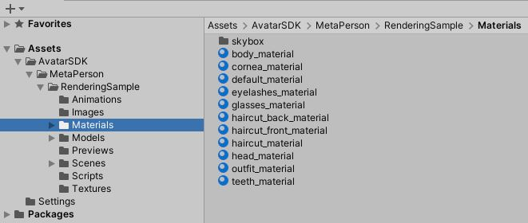

# MetaPerson - URP Rendering Sample

The **URP Rendering Sample** can be found in the `metaperson_rendering_urp` directory.

The critical configuration points that impact the models' appearance are described below.

## Materials

### Preconfigured Materials for FBX Models

Materials for **FBX** models are already preconfigured. You can select the sample model on the scene and see material values for a particular avatar's mesh.

### Template Materials for GLB Models

For **GLB** models, the use of template materials provides a flexible approach. These templates are dynamically applied to loaded models. 
The `MetaPersonMaterialGenerator` script takes a corresponding template material for each loaded mesh, instantiates this material, and sets the required textures.
You can find the template materials in the following directory: `Assets/AvatarSDK/MetaPerson/RenderingSample/Materials`. 

## Support

If you have any questions or issues with this project, please contact us at <support@avatarsdk.com>.
