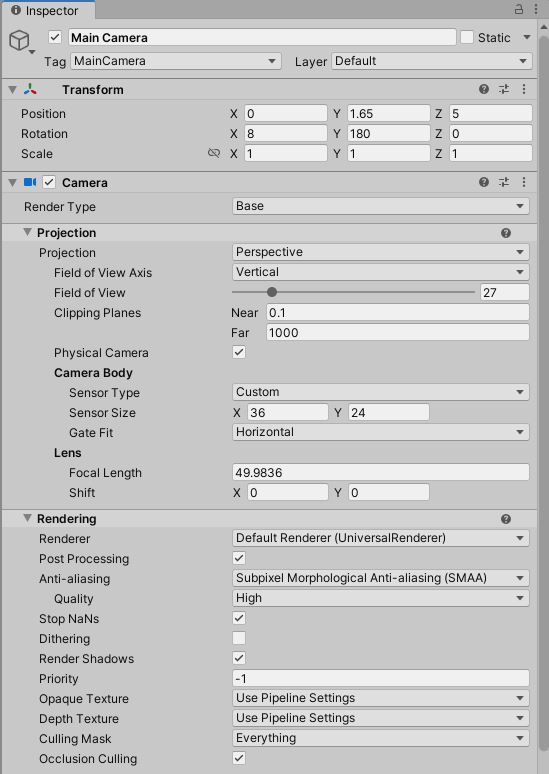
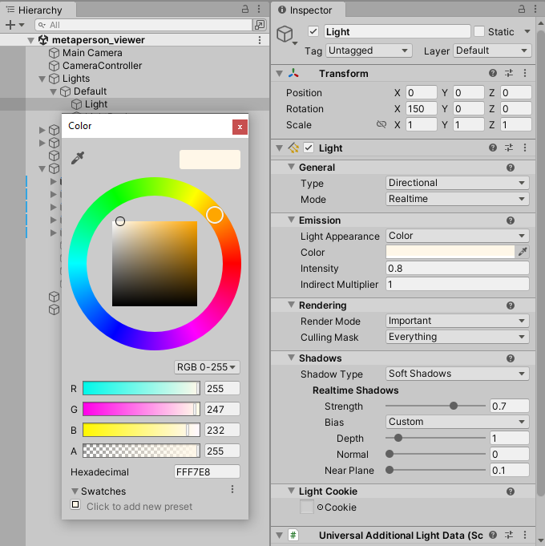
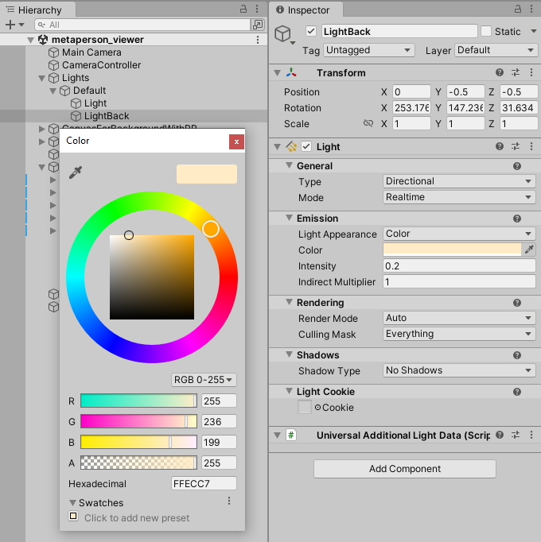
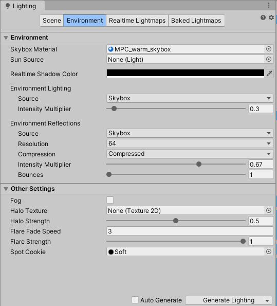
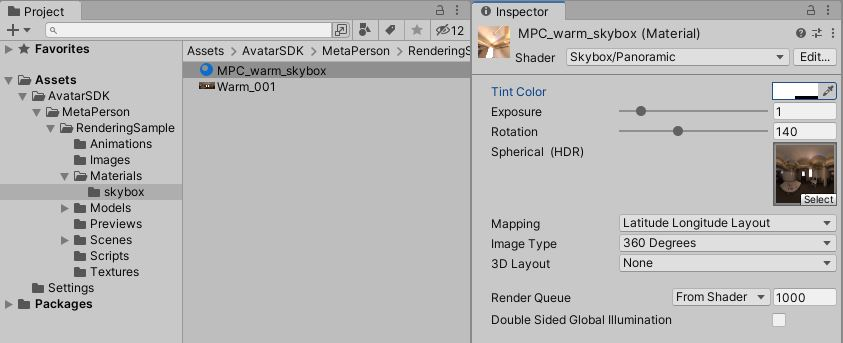
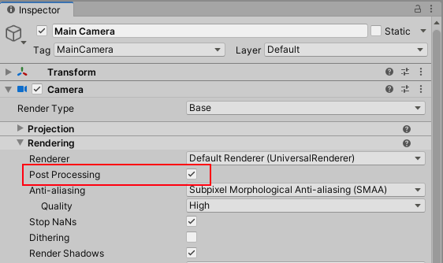
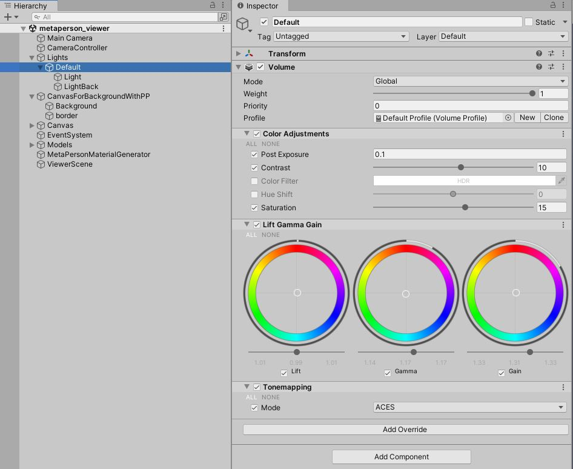
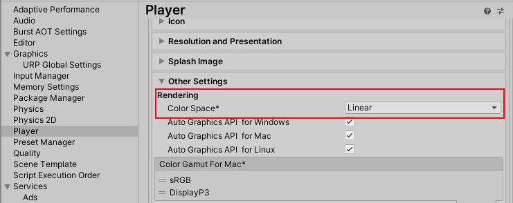
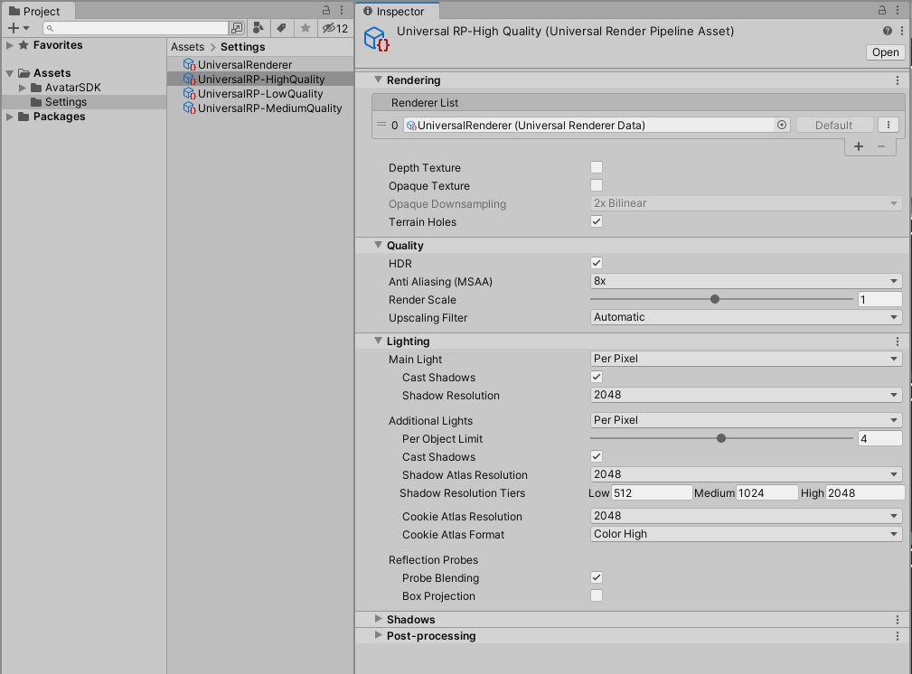
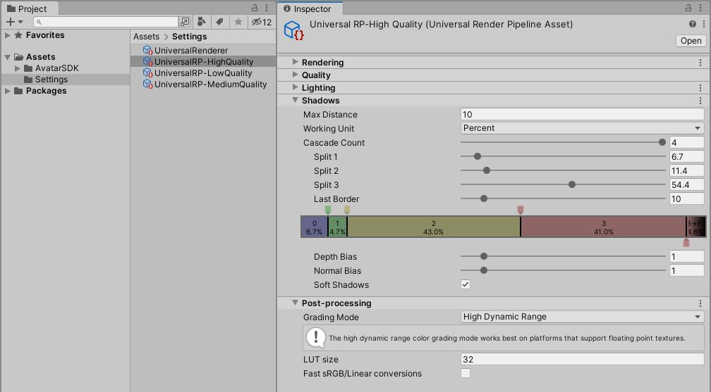

# MetaPerson - URP Rendering Sample

The **URP Rendering Sample** can be found in the [`metaperson_rendering_urp`](./../../main/metaperson_rendering_urp) directory.

The critical configuration points that impact the models' appearance are described below.

## Materials

### Preconfigured Materials for FBX Models

Materials for **FBX** models are already preconfigured. You can select the sample model on the scene and see material values for a particular avatar's mesh.

### Template Materials for GLB Models

For **GLB** models, the use of template materials provides a flexible approach. These templates are dynamically applied to loaded models. 
The `MetaPersonMaterialGenerator` script takes a corresponding template material for each loaded mesh, instantiates this material, and sets the required textures.
You can find the template materials in the following directory: `Assets/AvatarSDK/MetaPerson/RenderingSample/Materials`. 

## Camera

The Field of View (FOV) depends on the camera's position. When the camera is pointed at the avatar's head, the FOV is set to 40. When viewing the full-body model, the FOV is set to 27.

Other camera settings are shown below:

## Light Sources

There are two light sources configured to enhance the visual quality of the avatars:

1. Front directional light.
   

2. Back directional light.
   

## Environment Lighting

A special **skybox** is used as an environment with the following settings:

## Post-Processing

1. **Post Procesing** is enabled for the **Main Camera**. 

2. Global volume is configured as follows:

## Rendering and Quality Settings

The project works in **Linear** color space.

Quality settings have the following parameters: 

## Support

If you have any questions or issues with this project, please contact us at <support@avatarsdk.com>.
