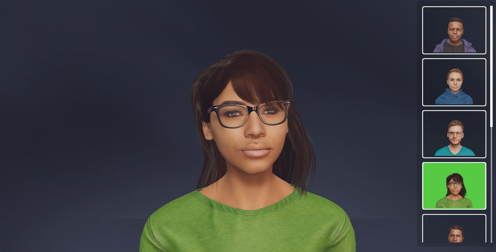

# MetaPerson - Unity Rendering Samples

This repository contains two sample projects demonstrating the rendering of **MetaPerson** avatars:

- [**Built-In Sample Project**](./Documentation/builtin_sample.md): showcases the exact rendering settings used in the Desktop version of the [MetaPerson Creator](https://metaperson.avatarsdk.com/).
- [**URP Sample Project**](./Documentation/urp_sample.md): shows how to render MetaPerson avatars using the Universal Render Pipeline to achieve a visual appearance similar to the [MetaPerson Creator](https://metaperson.avatarsdk.com/).

Both projects include several **FBX** models with preconfigured materials, ensuring you can see immediate results. 
Also there are some avatars that are loaded dynamically in **GLB** format, showcasing how to work with models at runtime.

## Support

If you have any questions or issues with this project, please contact us at <support@avatarsdk.com>.
