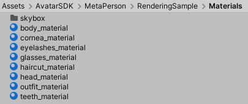
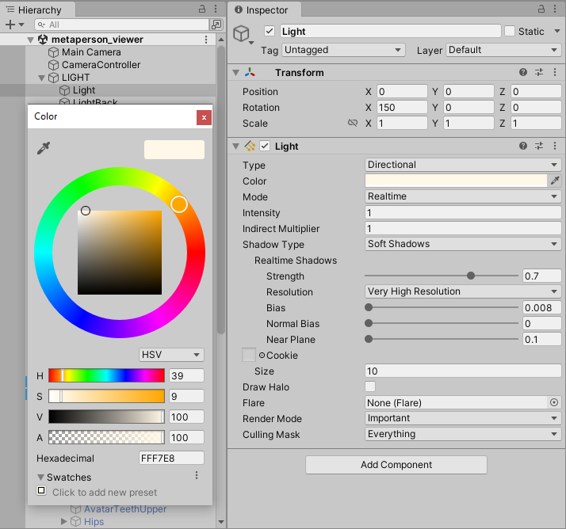
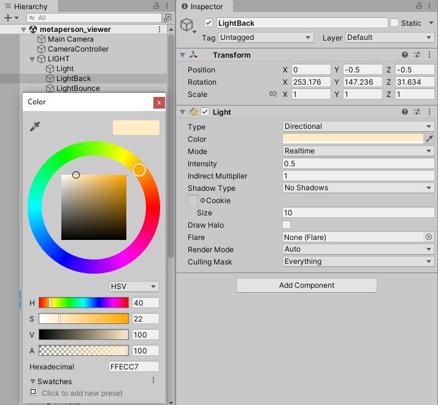
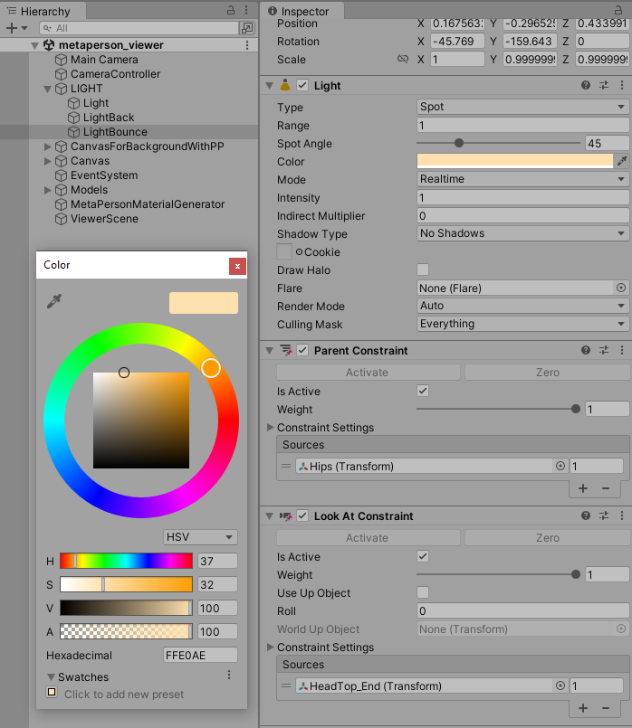
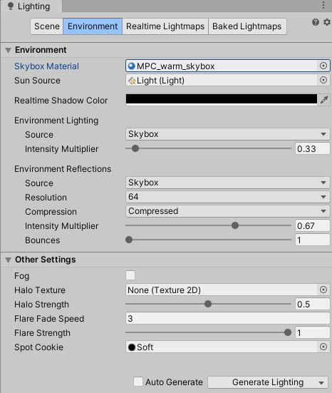
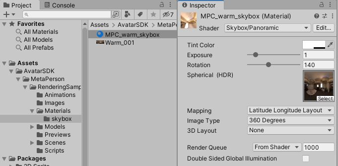
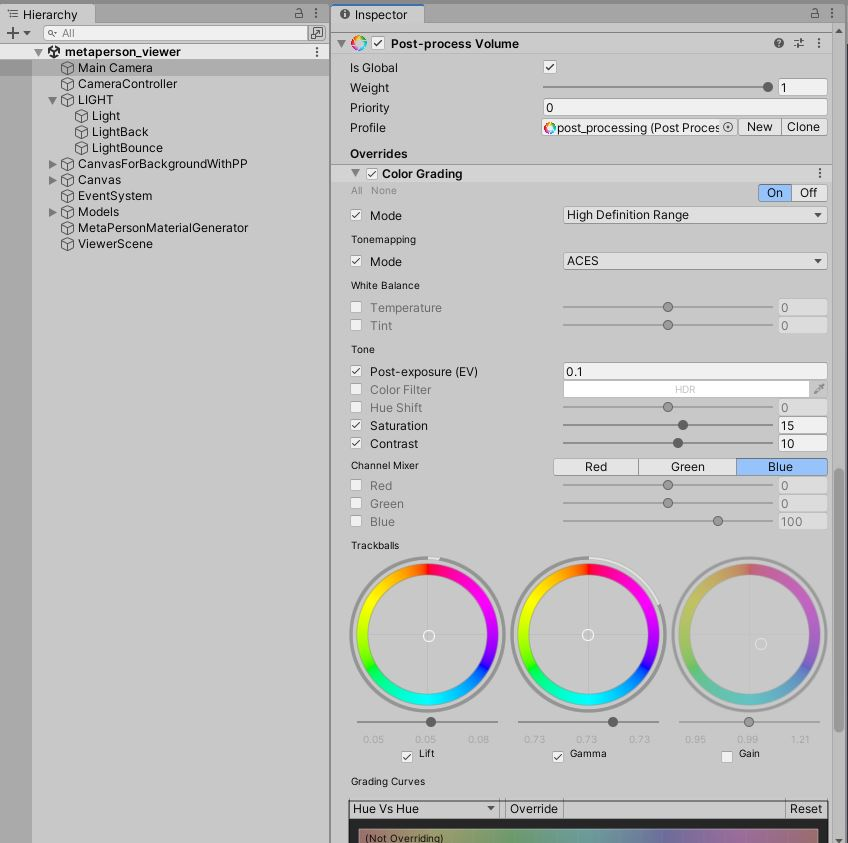
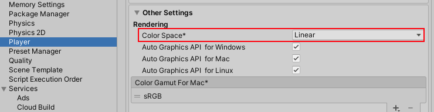
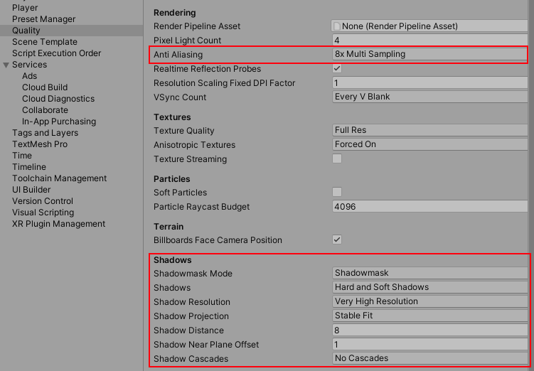

# MetaPerson - Unity Rendering Sample

This repository contains a unity project with the exact rendering settings used in the Desktop version of the [MetaPerson Creator](https://metaperson.avatarsdk.com/). It also incorporates a sample scene to showcase avatars.

The project includes several **FBX** models with preconfigured materials. Additionally, some models are dynamically loaded at runtime in **GLB** format.

The sections below describe the critical configuration points that impact the models' appearance.

## Materials

The project works with **Built-In** rendering pipeline.

### Preconfigured Materials for FBX Models

Materials for **FBX** models are already preconfigured. You can select the sample model on the scene and see material values for a particular avatar's mesh.

### Template Materials for GLB Models

For **GLB** models, the use of template materials provides a flexible approach. These templates are dynamically applied to loaded models. 
The `MetaPersonMaterialGenerator` script takes a corresponding template material for each loaded mesh, instantiates this material, and sets the required textures.
You can find the template materials in the following directory: `Assets/AvatarSDK/MetaPerson/RenderingSample/Materials`. 

## Default Light Sources

The default lighting contains three light sources configured to enhance the visual quality of the avatars:

1. Front directional light.
   

2. Back directional light.
   

3. Spotlight configured with constraints always points towards the avatar's head, ensuring that the face is well-lit and highlighted.
   

## Environment Lighting

A special **skybox** is used as an environment with the following settings:

## Default Post-Processing

The **Post-process Layer** is configured as follows:

Also, there is the global **Post-process Volume**:

## Rendering and Quality Settings

The project works in **Linear** color space.

We recommend setting **8x Anti-Aliasingg** and maximum **shadow** resolution. Also, we disabled **Shadow Cascades** for this sample.

## Additional Lighting Setups

In addition to the default lighting, there are six more setups that use another **Post-process Volume** and unique light sources.
You can switch between them to see the changes.

## Support

If you have any questions or issues with this project, please contact us at <support@avatarsdk.com>.
